```{r setup, include=FALSE}
knitr::opts_chunk$set(echo = TRUE)
options(knitr.kable.NA = '')
library(readr)
library(knitr)
library(kableExtra)
library(tinytex)
```

\vspace{2cm}

**Members:** Conghui Liu (20923584), Paul Ma (20879809), Huanqiu Wang (20946126), Min Gyu Woo (20665211)

\newpage

# Summary

This project tackles a binary classification task for a chosen fraud detection dataset, aiming to detect fraudulent bank accounts using various classification techniques and gain insights about the problem domain. We investigated, optimized, and evaluated four classification methods: Logistic Regression, Random Forest, XGBoost, and Neural Networks. In particular, the first three methods followed a unified data preprocessing and training pipeline, whereas the Neural Network approach was handled separately. This report describes the datasets and research problem, outlines the methodology for training and evaluating each model, and finally, discusses the results and findings regarding both the methods and the research domain. We conclude that Logistic Regression achieved the highest recall, while XGboost performs the best if the priority is to balance the precision and recall. Our analysis also suggests that the following four features are overall most effective in distinguishing if an account is fraudulent or not: an applicant's housing status, validity of provided home phone, the operating system of the device that made request, and whether the login session is kept alive.

# Introduction

## Dataset Description
Our proposed dataset is the Bank Account Fraud (BAF) Dataset Suite^[https://www.kaggle.com/datasets/sgpjesus/bank-account-fraud-dataset-neurips-2022], created and published by @jesus2022 for the 2022 Conference and Workshop on Neural Information Processing Systems (NeurIPS 2022). The primary intent behind this dataset suite is to provide a baseline tabular dataset for the robust evaluation of new and existing machine learning techniques as well as analysis of novel methods in machine learning fairness for addressing and detecting model bias.

<!-- A novelty to this dataset suite that reinforces its suitability as a test bed for fraud detection is its inclusion of realistic and interpretable features. The primary concern in the publishing of such datasets is that they typically present a large risk to the data privacy and security of individuals whose personal details were collected. To address this concern while maintaining data interpretability, the BAF datasets published by @jesus2022 consist primarily of synthetic data generated by means of a conditional tabular generative adversarial network (CTGAN), which was itself trained on real-world bank account fraud data. This, coupled with additional measures to ensure anonymity (by appropriately transforming possibly identifying features, eg. income) and removal of observations deemed too similar to existing real-world observations, allowed for the publication of such a dataset suite. This is in stark contrast to existing, and more popular, public datasets for fraud detection and imbalanced classification, such as the Credit Card Fraud Detection dataset^[https://www.kaggle.com/datasets/mlg-ulb/creditcardfraud], published as part of a research collaboration between Worldline and the Machine Learning Group^[https://mlg.ulb.ac.be] of ULB, for which anonymity is preserved via PCA transformations of the original real-world features.  -->

The BAF dataset suite itself consists of six separate datasets: one base dataset, and five variants. Each dataset contains 1 million observations, with 30 feature columns. Of these features, 19 are numeric, 5 are categorical, and 6 are binary. Two additional columns are present, one numerical column indicating the (relative) month the application for the bank account was made (ranging from 0 to 7) and the other target binary column indicating the presence of fraud (0 for no fraud, 1 for fraud) for the associated application. As expected, the class imbalance in each dataset is severe, with the number of applications labeled as fraud totaling around 11,030 out of 1 million, which is approximately 1.1% of the observations. 

Features include personal information about the customer (e.g., age, income, time lived at current and previous addresses, employment status), meta-information about the customer's application (e.g., number of applications made within a certain time period, device operating system from which application was made, whether the application was made from a browser or the phone app) and relevant banking information (e.g., credit risk score, proposed credit limit).

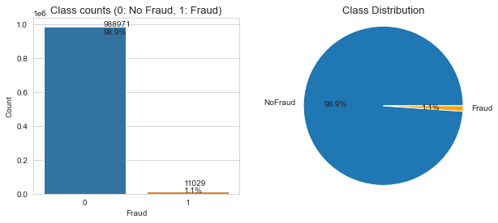{width=40% #fig:all_count}

For a full description of the features in the datasets, please see Appendix \@ref(app:datadesc). Exploratory data analysis was also performed and is reported in Section \@ref(intro:eda).

## Research Problem

The proposed binary classification task consists of performing fraud detection on bank account opening applications. Fraud detection is a notoriously challenging task, primarily due to the extreme class imbalance inherently present in relevant real-world datasets [@krawczyk2016; @dornadula2019; @puh2019; @makki2019]. As outlined in the dataset description, only approximately 1.1% of the synthetic observations (bank account opening applications) in the dataset are labeled as fraudulent - coupled with the significant size of the dataset and relatively large number of features, appropriate choices regarding feature engineering, imbalanced learning strategy and model selection are critical to achieving reliable results.

Due to the significant size of the base dataset and its five variants, we aim to restrict our analysis to the base dataset, of which a smaller subset (current consensus is to use 100,000 observations) is selected for training. 
<!-- Time permitting, additional analysis on fairness metrics for uncovering and evaluating biases, both in the data and in the trained models, could be explored using the five variant datasets. -->


## Data Exploration {#intro:eda}

### Features

Regarding income, the fraud group is more likely to contain extreme cases of high income. The average age of customers in the fraud group is higher than that of the no fraud group. Compared to the no fraud group, a higher frequency of fraud customers have free email accounts and a relatively large number of bank cards, coupled with invalid home phone numbers.

The graph in Figure \ref{fig:numeric_features}^[Moved to Appendix due to page limit.] shows that the fraud group is more highly concentrated in the logged-out state, i.e., _keep_alive_session_=0. The metric for similarity between name and email for the fraud group mostly centers around a lower level, likely indicating deliberate use of fabricated names by criminals, as might be expected in reality. Proposed credit limits for the fraud group have a lower frequency in the 500-1000 range, but a second peak is present at 1500. Given that this is the case, there is a clear peculiarity when observing credit risk scores. Although both groups are similarly normally distributed, the mean of the fraud group is higher despite the prevalence of larger credit limits. Indeed, one would typically expect that customers with higher credit risk scores would be offered a lower credit limit; as such, this phenomenon would warrant further investigation in a real-world scenario.  <!--Speculatively, this could suggest that the fraud group is willing to take more significant risks and is more willing to engage in fraudulent activities despite the higher risks associated with it.-->

<!-- 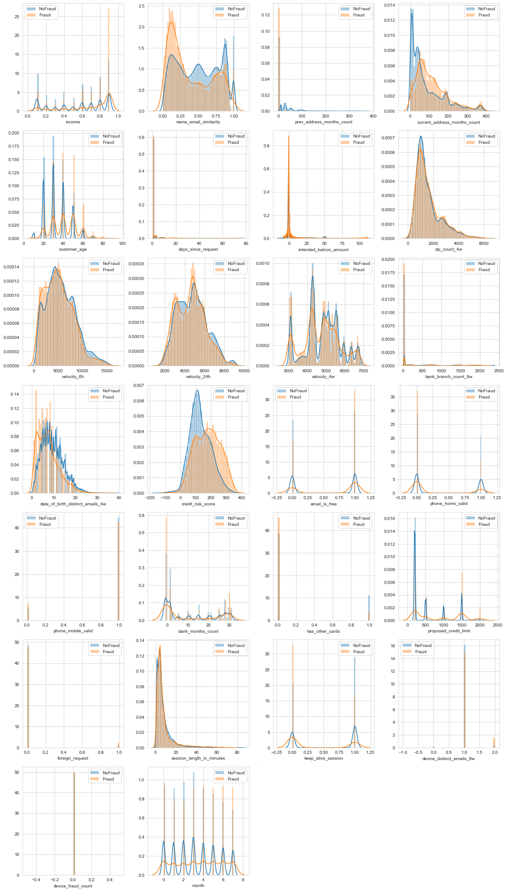{#fig:numeric_features} -->

When it comes to factor features, as shown in Figure \ref{fig:factor_features}^[Moved to Appendix due to page limit.], the fraud group shows a preference for credit payment plans (anonymized) AB and AC. Additionally, compared to the no fraud group, fraud customers' housing statuses (anonymized) tend to be more concentrated in the BA category<!--, indicating that they may be more likely to live in shared or temporary accommodations-->.

Another interesting observation is that fraud customers tend to use Windows computer systems more often when initiating payment requests. This could be because Windows is more widely used and readily accessible, making it easier for fraudsters to use in their activities<!-- Maybe more related to the tools and techniques that fraudsters emply - very likely that large scale fraud would be conducted on Windows systems; Linux is relatively technical and Apple computing devices tend to be expensive -->.

Overall, differences between the two groups are relatively few, particularly when considering other features not mentioned above. Nonetheless, these observations highlight potential characteristics of fraud customers that could help identify and prevent fraudulent activities.

<!-- 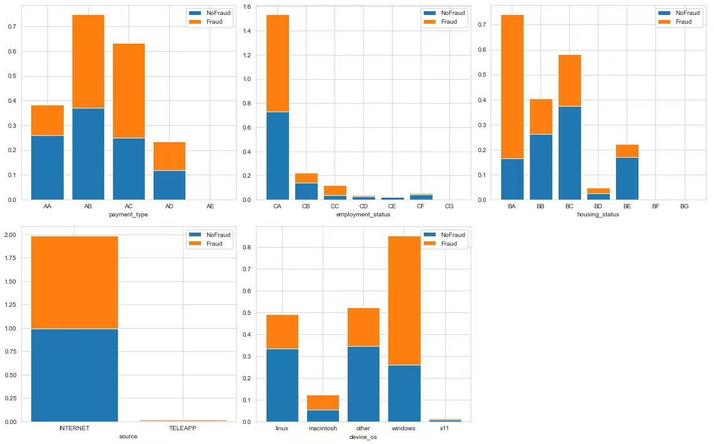{width=70% #fig:factor_features} -->

### Correlations

As can be seen in Figure \ref{fig:correlations}^[Moved to Appendix due to page limit.], there is a strong linear positive correlation between _velocity_24h_, _velocity_4w_, and _velocity_6h_, which is expected since they are all measures of the velocity or frequency of transactions. This correlation suggests that an increase in one measure is likely to be accompanied by an increase in the others. Similarly, there is a strong correlation between _proposed_credit_limit_ and _credit_risk_score_, which is reasonable as well. This correlation suggests that higher credit limits are generally associated with higher credit risk scores, which is a common practice in the lending industry since higher credit risk scores indicates a lower risk of default.

On the other hand, most of the other predictors do not show strong correlations with each other, indicating that they are independent variables and may have different impacts on the outcome variable. Understanding these relationships can help organizations make more informed decisions about which predictors to prioritize in their fraud detection efforts, ultimately improving their ability to detect and prevent fraudulent activities.

<!-- 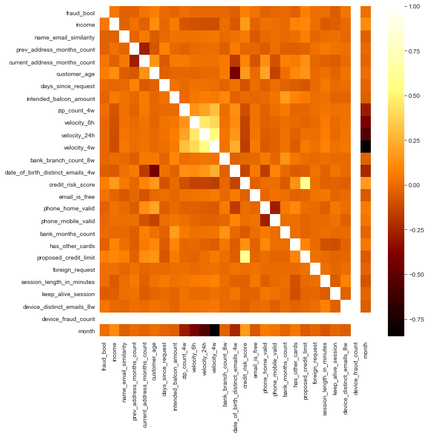{height=40% width=60% #fig:correlations} -->

The correlation between response and other predictors are as shown in Table \ref{tab:predcorr}.<!--There is a significant linear positive correlation between credit_risk_score and proposed_credit_limit. This is not surprising as these two variables are often used together in lending decisions. A high credit score is usually associated with a higher credit limit since it indicates a lower risk of default.--> There is a strong negative linear correlation between keep_alive_session and fraud. This suggests that fraudsters are more likely to log out of their accounts frequently, perhaps to avoid detection or limit their exposure to scrutiny.

Most of the other predictors show some degree of linear relationship with fraud, with the exceptions of days_since_request and bank_months_count, which show weaker linear correlations. 

```{r predcorr, echo=FALSE, fig.env='table'}
Correlation=data.frame("Covariates1"=c("credit_risk_score","income","email_is_free","session_length_minutes",
                                      "bank_months_count","bank_branch_count_8w","intended_balcon_amount",
                                      "has_other_cards","keep_alive_session")
                       ,"Corr1"=c(0.07,0.05,0.03,0.01,-0.00,-0.01,-0.02,-0.04,-0.05)
                       ,"Covariates2"=c("proposed_credit_limit","device_distinct_emails_8w","foreign_request",
                                       "zip_count_4w","velocity_24h","phone_mobile_valid",
                                       "prev_address_mons_count","name_email_similarity",NA)
                       ,"Corr2"=c(0.07,0.04,0.02,0.01,-0.01,-0.01,-0.03,-0.04,NA)
                       ,"Covariates3"=c("customer_age","current_address_mons_count","month","days_since_request",
                                       "velocity_4w","velocity_6h","phone_home_valid",
                                       "date_birth_distinct_ema_4w",NA)
                       ,"Corr3"=c(0.06,0.03,0.01,0.00,-0.01,-0.02,-0.04,-0.04,NA))
knitr::kable(Correlation,caption="Correlation between response and predictors")
```


# Methods

## Data Pre-Processing

The raw data must be processed in order to obtain usable features. The data will be sampled, encoded, split into training and testing sets, and finally cross-validated, with normalization performed separately  on each set of training folds during cross-validation to avoid data leakage.

### Sampling {#section:sampling}
The two biggest concerns for this dataset are the large number of data points (one million observations) and the extreme class imbalance. In order to obtain valid results, a proper sample of the dataset must be obtained. For the sampling pre-processing step, the method of weighted random sampling strategy was used to ensure that the probability of drawing a certain class is proportional to the weight assigned to that class. <!-- This needs updating? -->The weights will be calculated by the 'WeightedRandomSampler' function in Pytorch based on the rarity of the labels. Specifically, the probability of drawing a "fraud" entry will be much higher than that of drawing a "no fraud" entry. Comparing Figure \ref{fig:all_count} and Figure \ref{fig:sample_count}, it can be seen that the majority class has been reduced significantly, but the minority class remains the same. This way, computationally, the modeling can be done in a reasonable amount of time.

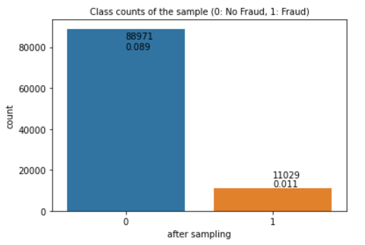{width=35% #fig:sample_count}

### Categorical Variables: One-Hot Encoding

There are several instances of categorical variables in the dataset, namely _payment_type_, _employment_status_, _housing_status_, _source_, and _device_os_. In order to feed these categorical variables into the model, one-hot encoding is applied. 

### Numerical Variables: Normalization {#section:normalization}

Going back to Figure \ref{fig:numeric_features}, the numerical covariates have a vast range of values. For example, _income_ is in the range between [0,1] since it denotes the quantiles of income for applicants, while _customer_age_ consists of multiples of 10. For best results, the numerical covariates must be normalized following the train-test split as part of the cross-validation pipeline (in order to avoid data leakage). The method for normalization was using *sklearn* 'StandardScaler'. This method computes the mean and standard deviation for each individual column, which are normalized by applying Z-Score Normalization. More concretely,

$$z = \dfrac{x-\mu}{\sigma}$$
where $\mu$ and $\sigma$ are the mean and standard deviation of the column, respectively, and $x$ is the numerical value.

### Cross-Validation
Due to the minority class being proportionally extremely small, cross-validation will be useful in reducing bias while fitting the best model. In this case, the class ratios are preserved for both the training and test datasets (stratified) and $5$-fold cross-validation will be applied.

### Hyperparameter Tuning
Hyperparameter tuning is an essential step in determing which fitted model performs the best. The method used in this project is sklearn's GridSearchCV function. Essentially, given a set of hyperparameter values, GridSearchCV will fit the corresponding model to every combination of the hyperparameters represented. Using Stratified 5-fold cross validation the hyperparameter values will be used to fit the model. In the end the "best" model is chosen by the model that maximizes the Matthews correlation coefficient, which takes into consideration true/false positives and negatives and is considered a "balanced" measure.

## Imbalanced Data Solutions
Since the dataset has an extreme imbalance in the two classes, the approach is to find an imbalanced learning method that can address this inequality. There will be three different approaches: SMOTE oversampling, cost-sensitive weight balancing, and a baseline consisting of no imbalanced learning strategy. Note that the methods are used after obtaining the reduced dataset. 

Additionally, MCC, F1 and ROC AUC are used as measures of imbalanced classification performance, with accuracy, recall and precision as supporting metrics for interpretation.


### Evaluation Metrics {#section:evalmetrics}

Class imbalance causes issues with typical classification metrics, such as accuracy and corresponding misclassification error [@chicco2020;@zhu2020;@krawczyk2016]. In this scenario, a low misclassification error (high accuracy) is trivially easy to obtain if a model simply predicts the majority class for every observation. This creates a significant possibility for misinterpretation of model performance, as the observer may be led to believe that the model is performing far better than it actually is. A similar issue arises around precision as an evaluation metric, whereby a model that is extremely conservative with predicting the target minority class may trivially result in an extremely high measure of precision. A number of alternative metrics exist for imbalanced classification, including MCC and F1 score, as considered here.

MCC (Matthew's correlation coefficient) is a measure of the quality of binary classifications that takes into account true and false positives and negatives. It is defined as follows:
\begin{equation}
MCC = \frac{TP\times TN - FP\times FN}{\sqrt{(TP+FP)(TP+FN)(TN+FP)(TN+FN)}}
\end{equation}
where $TP$ represents the number of true positives, $TN$ represents the number of true negatives, $FP$ represents the number of false positives, and $FN$ represents the number of false negatives.

The MCC ranges between -1 and 1, where 1 indicates a perfect prediction, 0 indicates a random prediction, and -1 indicates a completely wrong prediction. A score of 0 implies that the classifier has learned nothing.

F1 score is a similar binary classification metric that is defined as follows:
\begin{equation}
F1 = 2\times\frac{precision\times recall}{precision+recall}
\end{equation}
where precision is the ratio of true positives to the sum of true positives and false positives, and recall is the ratio of true positives to the sum of true positives and false negatives.

F1 score ranges between 0 and 1, where 1 indicates perfect precision and recall, and 0 indicates poor performance.

As outlined by @chicco2020 and @zhu2020, there exists some debate as to which of MCC and F1 is the superior metric for imbalanced classification tasks, though F1 appears to be less suitable to cases where some degree of importance is still attributed to the non-target negative (majority) class. Additionally, it is significantly more sensitive to which class is chosen to be the target positive class, whereas MCC is invariant to this choice. As such, we select MCC as our primary scorer for hyperparameter tuning.

### Synthetic Minority Oversampling Technique (SMOTE) {#section:smote}
SMOTE is an oversampling technique that generates synthetic samples from the existing ones. The generation process for our binary case is as follows:

1. Pick a random point $x$ in the minority class
2. Calculate $k$ nearest neighbors of $x$
3. Generate a new synthetic point that is in the vicinity of the $k$ neighboring points
4. Repeat 1-3 until the number of points in the minority class is equal to the number of points in the majority class.


### Balancing Weights (Cost-Sensitive)
Instead of oversampling, this technique will allow the model to adjust the estimator fitting process by tweaking how the loss is computed. In this case having _class\_weight = "balanced"_ allows the model to make sure that the weight of the two classes when computing the loss is the same. Therefore, the trained model would have learned the importance of both classes equally even though the amount of data in one class is much higher than the other. 

For models that do not have the _class_weight_ parameter, an equivalent parameter with similar weight balancing is set. If no such alternative exists, the cost-sensitive variant is excluded from the analysis.


## Classification Methods

### Logisitic Regression


We modeled logistic regression in Python using the "liblinear" solver in **sklearn** library, as it incorporates both the L1-Norm and L2-Norm. The hyper parameters we tuned are as follows:

- 'penalty': ['l1', 'l2']
- 'C': [0.001, 0.01, 0.1, 1, 10]

where the larger $C$ is, the more penalty strength imposed.

### Random Forest

Random Forest (RF) normally generates more accurate classification results than a single tree, if not accounting for interpretability. The implementation of the RF for this analysis was built on the **sklearn** library in Python. For hyperparameter tuning, we considered the maximum depth of the tree and the number of decision trees to fit in the random forest. The specific parameters chosen are:

- 'max_depth' (where 'None' indicates no maximum depth): [None, 1, 7, 13, 19]
- 'n_estimators': [50, 75, 100]


### Support Vector Machine (SVM)

As planned in the proposal, we attempted the SVM training with the following parameters:

- 'C': [0.1, 1, 10]
- 'kernel': ['rbf', 'poly', 'linear']

However, we could not get a complete result due to the tremendous amount of time needed to train SVM, especially on the SMOTE sample. We replaced our SVM analysis with RF instead.


### XGBoost

XGBoost stands for Extreme Gradient Boosting and is an optimized implementation of gradient boosting. It utilizes a similar concept to that used in random forest, in that the model is built on top of multiple decision trees (ensemble learning). However, the difference is that instead of averaging all of the decision tree predictions, it is an extension of boosting where the process of additively generating weak models is formalized as a gradient descent algorithm over an objective function. The algorithm works by building an ensemble of weak learners, where each new learner corrects the errors made by the previous learners.   

More concretely, for each iteration $t=1,\ldots,T$, do the following:

- Compute the negative gradient of the binary cross-entropy loss with respect to the current predictions, 
$\mathbf{r}_t = -\left[\frac{\partial \ell(y_i, p{i,t-1})}{\partial p_{i,t-1}}\right]{i=1}^n$, 
where $\ell(y_i, p{i,t-1}) = -\left[y_i \log(p_{i,t-1}) + (1-y_i) \log(1-p_{i,t-1})\right]$ is the binary cross-entropy loss and $p_{i,t-1}$ is the predicted probability of the positive class for instance $i$ at iteration $t-1$.
- Fit a decision tree $f_t(\mathbf{x})$ to the negative gradients $\mathbf{r}_t$ by minimizing the sum of squared errors between the predictions of $f_t$ and $\mathbf{r}_t$.
- Update the ensemble by adding the new decision tree with a learning rate $\eta$, such that $p_{i,t} = p_{i,t-1} + \eta f_t(\mathbf{x}_i)$.
- Apply regularization techniques, such as subsampling, maximum depth, minimum child weight, and shrinkage, to prevent overfitting.
- Predict the positive class for an instance if $p_i > 0.5$, and the negative class otherwise.

We will use the **XGBoost** and **sklearn** libraries in Python, using cross-validation to determine the optimal hyperparameters. In particular, the learning rate *eta*, the maximum depth of the trees, the minimum sum of weight needed in a child, and the minimum loss reduction required to allow for a split on a leaf node *gamma*. The specific parameters chosen are as follows:

- 'eta': [0.01, 0.1, 0.2]
- 'max_depth': [3, 6, 9]
- 'min_child_weight': [1, 3, 5]
- 'gamma': [0.0, 0.1, 0.2]


### Neural Network (NN)

Neural Network training was conducted separately from the pipeline for training the other models. This section outlines the data preprocessing, model architecture, hyperparameters, as well as the training and evaluation details specific to NN. 

**Data Preprocessing:** Cross validation was not used for NN primarily due to two reasons: 1) NN is computationally expensive. Cross-validation involves training and evaluating the model multiple times, which can significantly increase the computational burden in the case of NN. 2) NN often works best with large datasets. Segmenting the data into folds culminates in training on a smaller sample and, giving rise to potentially less accurate results for each fold. This effect may even be magnified in the case of a highly imbalanced dataset, where there are far fewer observations in the minority class to begin with. Instead, we split the baseline sample (100k, obtained in Section \@ref(section:sampling) into stratified training, validation, and testing sets with a 70:15:15 ratio. We normalized the data using the training data's mean and standard deviation, as described in Section \@ref(section:normalization), to avoid data leakage.

The NN model was analyzed using two samples: the baseline sample and a SMOTE sample. For the baseline sample, the model was trained, evaluated, and tested on the aforementioned training, validation, and test data. For the SMOTE sample, we concatenated the training and validation data back together, the result from which we drew a balanced oversample via the SMOTE approach illustrated in Section \@ref(section:smote). We then re-split it into training and validation sets with an 85:15 ratio for training and evaluation of the model, after which we tested the model using the same test set as the baseline.

**Model Architecture:** The model is essentially a 6-layer MLP with one residual connection (a technique to address the vanishing gradient problem and improve training performance by adding the input of a set of layers directly to their output, thus encouraging the network to learn the residual function). The structure of each layer is defined as follows:

$$
\begin{aligned}
&\underline{Layer}:  &\boldsymbol{y_1}= Dropout(ReLU(BatchNorm(W_1 * \boldsymbol{x} + b_1))) \\
&\underline{Layer 2}:  &\boldsymbol{y_2}= Dropout(ReLU(BatchNorm(W_2 * \boldsymbol{y1} + b_2)))\\
&\underline{Layer 3}:  &\boldsymbol{y_3}= Dropout(ReLU(BatchNorm(W_3 * \boldsymbol{y2} + b_3)))\\
&\underline{Layer 4} (Residual):  &\boldsymbol{y_4} = Dropout(ReLU(BatchNorm(W_4 * \boldsymbol{y3} + b_4))) + \boldsymbol{y_1}\\
&\underline{Layer 5} (Output):  &\boldsymbol{y_5}= W_5 * \boldsymbol{y4} + b_5\\
&\underline{Layer 6} (Activate): &\boldsymbol{y_{out}}= Sigmoid(\boldsymbol{y_5})
\end{aligned}
$$

- $\boldsymbol{x}$ is the input feature vector.
- $\boldsymbol{y_j}, W_j, b_j$ are the jth layer's output, weights and biases, respectively.
- $Dropout(\cdot)$ is a function that randomly deactivates the neurons in a layer with probability $p$ (dropout rate) to prevent overfitting.
- $ReLU(\cdot)$ is a popular activation function that takes an input value and returns the maximum of that value and zero. I.e., it "rectifies" negative values to 0.
- $BatchNorm(\cdot)$ is a function that normalizes the output of a layer by adjusting and scaling the activations to have a mean of 0 and a standard deviation of 1.


One can argue that each layer from 1 ~ 3 is actually four layers, but we consider them as one layer for this project, as the $BatchNorm + ReLU + Dropout$ combination is considered to be common practice. We will keep this convention in this report. Similar to logistic regression, the last output layer determines the optimal class by using a single node where: $\hat{y} = \mathbf{I}(y_{out} > 0.5)$

**Hyperparameters**: The number of non-residual layers (layer 1 ~ 3), the size of each hidden layer, and the dropout rate are the primary hyperparameters we tuned. They were set to 3, 27, and 0.25 through trial and error. For example, we experimented with both the arithmetic mean rule and the geometric mean rule for the hidden layer size. The former is defined as $\frac{size(input) + size(output)}{2}$, and the latter as $\sqrt{size(input) * size(output)}$. We found that the former yielded better results ($\frac{51+1}{2} = 26 \approx 27$). This report will not extensively list all explored hyperparameters.

**Training and Evaluation:** We trained the model for 300 epochs when running on the baseline sample and 500 epochs on the SMOTE sample, as the latter contained almost doubled the amount of data. The model parameters were updated every epoch, and each updated model was evaluated on the validation set to yield the "current performance". A tracker to track the model performance was initialized prior to training, and we saved the model in the epoch where the current performance was superior to all previous performances. In other words, instead of using the model from the last epoch, we grabbed the saved checkpoint which yielded the best validation accuracy, and used it for the final assessment on the test set. This tuning approach was utilized to prevent overfitting, as the model parameters in the last epoch usually yielded a minimum training loss but not necessarily the highest validation accuracy. The validation accuracy was represented by the summation of MCC and ROC/AUC scores. 

The $BCEWithLogitsLoss$ (binary cross entropy with logits loss) was utilized as the loss function for the imbalanced baseline sample as it essentially penalizes the model more for wrongly predicting a minority class. The cross entropy loss, which measures the difference between the predicted probability distribution and the true probability distribution of the class, was applied in SMOTE sample as there wasn't an imbalance. For optimization, we used the stochastic gradient descent (SGD) approach combined with a learning rate scheduler and multiple other optimization techniques. It is sometimes believed that as long as the learning rate is small enough, the model will eventually converge given enough epochs. This belief is not strong enough to shadow the importance of optimization due to two reasons: 1) there is usually limited time and resources to support extensive training in reality, and 2) it is likely that the model gets stuck in a local minimum and therefore needs intervention to jump out of it. A full list of optimization related parameters can be found in Appendix \@ref(app:nnparams), including the solution to address the second reason above.


# Results

## Model Assessment

The performance of all models are displayed in the table below. For tuned model hyperparameters, see Figure \ref{fig:hyperparams} in the Appendix.

{width=40%}


The "best" models and strategies change depending on which metrics are deemed important. In this specific dataset, the TN (the predicted and actual "good guys") is the group we care about the least. Therefore, we put less weight on accuracy and the MCC score. We care about the following two aspects the most, depending on the use case and perspective:

(1) Recall: Of all the actual frauds, how many have I succesfully detected?
(2) Precision: Of all the predicted frauds, how many are actually frauds? 

We care about (1) the most when the priority is to catch as many frauds as possible, even at the expense of wronging the "good guys". Logistic Regression performed the best in this sense, yielding the highest recall of ~0.79 for the cost sensitive strategy and ~0.774 using SMOTE. The second best classifier is NN, showing ~0.772 on the SMOTE sample and ~0.679 on the baseline. Note that the NN baseline utilized a loss function that assigns more weight to minority classes. In other words, the NN baseline behaves similar to the cost-sensitive strategy for the non-NN models.

On the other hand, (2) is usually more important to an operational staff in a bank whose everyday work is to go through many suspicious cases and filter out who are the actual frauds. These working professionals expect a high percentage of actual frauds out of all the suspicious cases. The RF classifier produced the highest precision (~0.72) when run on the baseline sample, followed by the XGBoost classifier, which had equally high precision (0.7) on the baseline. 

While we want both the precision and recall to be as high as possible, it is usually hard to achieve both. F1 is an important metric to look at if the goal is to find a balance between the two (see Section \@ref(section:evalmetrics)). The XGBoost classifier won in this aspect, showcasing a ~0.537 of f1-score for cost-sensitive and ~0.534 for SMOTE. Tightly following are the baseline NN (~0.530) and the RF (~0.525 for both SMOTE and cost sensitive). 

In addition, ROC/AUC provides an aggregate measure of performance across all decision thresholds and thus is also a helpful candidate for a balance. NN (both baseline and SMOTE) was the winner for ROC/AUC and had a score greater than 0.87. Subsequently, LogisticRegression (SMOTE and cost-sensitive) ranked the second with ROC/AUC greater than 0.795, and it's followed tightly by XGBoost with cost sensitive (also ~0.79).

Based on the above observations and analysis. We make the following conclusions:

- The baseline strategies yielded great precision, but for all the other metrics, it needs to rely on an imbalance-handling strategy to boost performance. This is not surprising, as precision is trivially easy to achieve if the model is relatively conservative about classifying the minority class.
- Logistic regression, when paired with a cost-sensitive or SMOTE strategy, is the ultimate winner in terms of "recalling" the most amount of frauds, which is the most difficult metric to achieve. This could indicate that the dataset, or the problem domain, are best explained using a linear classifier.
- However, logistic regression was mediocre in balancing precision and recall. In contrast, XGB emerged as the superior method for this purpose, in terms of both the relevant scores and training time.
- NN has a sharp edge over all other methods in terms of ROC/AUC performance. However, it is not recommended due to its extensive training time and poor interpretability, unless one's goal is solely to optimize the ROC/AUC. It is important to note that the training time for NN mentioned above is based on GPU utilization.


## Feature Importance

Feature importances are reported here for the Logistic Regression models (see Figure \ref{fig:log_importances}), Random Forest models (see Figure \ref{fig:rf_importances}) and XGBoost models (see Figure \ref{fig:xgboost_importances}). Due to the large number of features, these only include the top and bottom five features by absolute importance. 

In the case of the Logistic Regression models, importance is a stand-in for the model coefficients, i.e., important covariates are those with coefficients with higher magnitude, signifying larger impact on the log-odds of the bank account being fraudulent.

The Random Forest and XGBoost models differ from Logistic Regression in that they directly report the relative importance of features in making their predictions. For Random Forest, feature importance is based on the average reduction in impurity across all decision trees in the forest that use that feature, where features that consistently lead to greater reduction in impurity across the ensemble are considered more important. For XGBoost, a "gain" metric is used instead, and is defined as the improvement in the loss resulting from splits on a particular feature; this metric is then normalized for all features and reported as the feature importances.

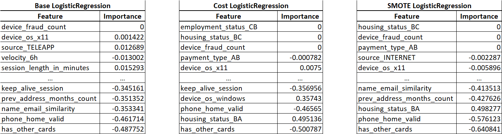{width=60% #fig:log_importances}

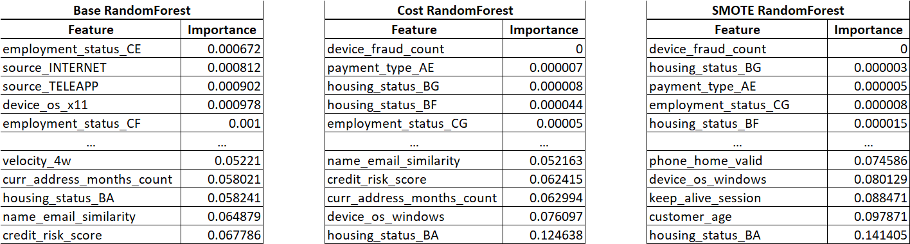{width=60% #fig:rf_importances}

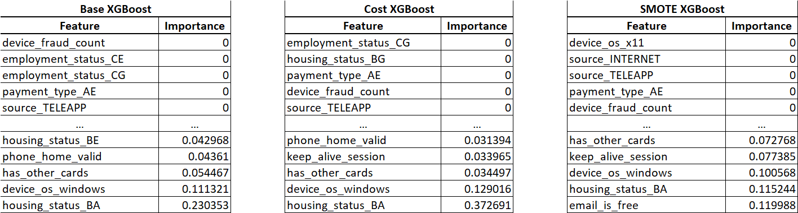{width=60% #fig:xgboost_importances}

Among the features reported here, the most consistently non-important include _source_ (i.e., whether the application was made from a web browser or phone app), _device_os_ (specifically "X11", and primarily among Logistic Regression models), _payment_type_ ("AE" and "AB"), _housing_status_ ("BC" and "BG"), _employment_status_ ("CE" and "CG"), and, interestingly, _device_fraud_count_ (i.e. the number of fraudulent applications made on application device). 

According to the Logistic Regression models, two of the most important features for predicting a fraudulent account include a _device_os_ of "Windows" and a _housing_status_ of "BA", both of which appear to have relatively high importance in both the Random Forest and XGBoost models. On the other hand, the most important predictors of a legitimate account include _has_other_cards_ (corroborated by XGBoost), _phone_home_valid_ (also corroborated by XGBoost) and _keep_alive_session_ (with high importance for all three models).

Generally, there appears to be more inconsistency of feature importances when comparing between models than when comparing between imbalanced learning strategies, though overall there appear to be a few standout features with relatively high predictive power. The higher importances of _phone_home_valid_, _keep_alive_session_, _device_os_ (specifically "Windows") and _has_other_cards_ is consistent with the data exploration analysis performed in Section \@ref(intro:eda). 


# Discussion

To conclude, logistic regression and XGBoost oudstood as the most effective classifiers for achieving the highest recall and the optimal balance between precision and recall, respectively. With regards to feature importance, analysis of model coefficients and relevant metrics showed a few potentially significant features in the detection of fraud. Two of the strongest predictors for a fraudulent account are the use of a Windows operating system during the bank account opening request and a housing status of "BA" (specics unknown due to anonymization for privacy purposes). In contrast, significant predictors for a legitimate account include possession of other banking cards with the same institution, having a valid home phone number and the selection of the keep-alive option for user login sessions. 

Due to the computational and time constraint, only a sub-sample of the dataset was used. This, in turn, weakened the modeling process and the cross-validation step. For future research, using a device with more resources and stronger computational capabilities would enable more time-efficient training of the models and the ability to include the entire dataset. This would provide a clearer picture of model performance and the suitability of the imbalanced learning strategy.


\newpage

\appendix

# Appendix

## Dataset feature descriptions and EDA figures {#app:datadesc}

```{r echo=FALSE, results='asis'}

data_description <- read_csv("data_description.csv", show_col_types = FALSE)

data_url <- "\\\\href{https://github.com/feedzai/bank-account-fraud/blob/main/documents/datasheet.pdf}{https://github.com/feedzai/bank-account-fraud/blob/main/documents/datasheet.pdf}"

data_description %>%
  kbl(
    booktabs = TRUE,
    caption = "Description of dataset features",
    position = "!htb"
  ) %>%
  kable_styling(
    latex_options=c("striped"), 
    font_size = 7,
    full_width=TRUE
  ) %>%
  footnote(
    general=paste('Sourced from BAF Datasheet:', data_url, '.'),
    footnote_as_chunk = TRUE, 
    escape = FALSE
  )

```

\newpage

## Exploratory Data Analysis Figures

{width=80% #fig:numeric_features}

{width=70% #fig:factor_features}

{width=60% #fig:correlations}


\newpage

## NN optimization parameters, training losses and performances {#app:nnparams}

**batch_size:** 50

**device**: gpu

**learning rate:** 0.02

**optimizer**: SDG

**momentum:** 0.9 (to helps SGD to accelerate towards the minimum of the loss function)

**nesterov:** True (improves convergence by taking into account the future gradient at the predicted next position and helps to reduce oscillations and overshooting.)

**weight decay:** 0.0001 (L2 regularization that penalizes large weights)

**learning rate scheduler for baseline:** `CosineAnnealingWarmRestarts` (periodically shoots up the learning rate aiming to jump out of a local minimum)

**Training losses for baseline:** the sudden increase in both the validation and training loss demonstrates the effect of the above scheduler. However, the loss after the leap did not converge to a smaller value. The reason is either that the leap was not successful and the model converges to the same minimum, or that it converged to a different but equally good minimum.

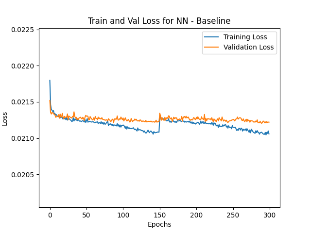{width=50% #fig:NN_Loss_Baseline}

**Training accuracies for baseline:** The AUC score reveals a slim and fluctuating growth across the epochs, wherease the MCC score barely increased.

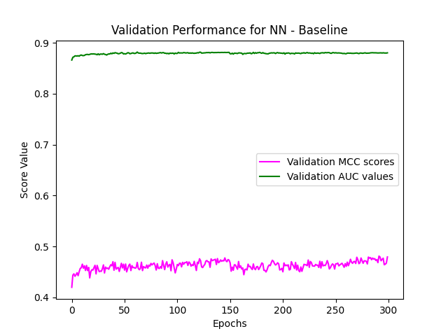{width=50% #fig:NN_performance_Baseline}

**learning rate scheduler for SMOTE:** `ExponentialLR` (The learning rate decreases exponentially from the starting rate 0.02). We used a different scheduler from the baseline as we found that the previous scheduler was not able to bring us to a better minimum.

**Training losses for SMOTE:** Both the training and the validation losses converged early on. They exhibited the same convergence pattern, with the validation loss strictly greater than the training loss for all epochs.

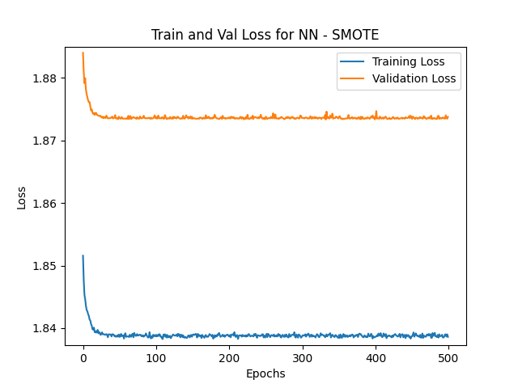{width=50% #fig:NN_Loss_SMOTE}

**Training accuracies for SMOTE:** Both scores started to increase at the beginning and stablized during the early epochs.

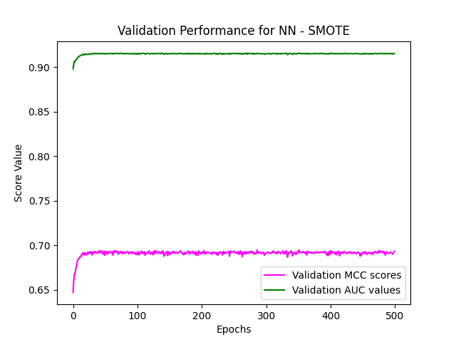{width=50% #fig:NN_performance_SMOTE}


\newpage

## Tuned Hyperparameters

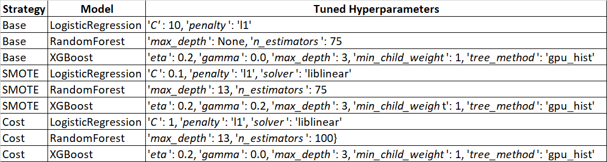{width=60% #fig:hyperparams}

## Confusion matrix

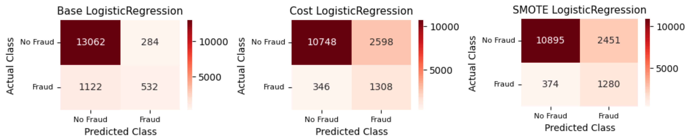

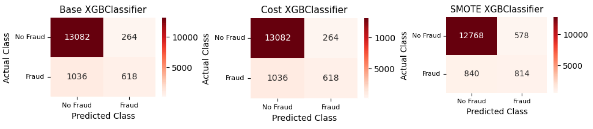

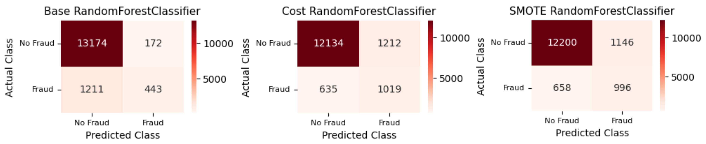

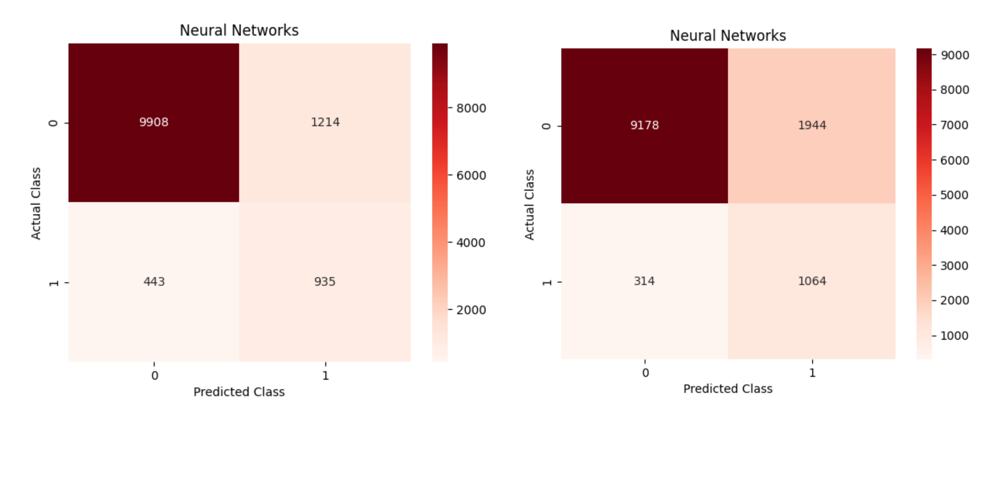

\newpage

## Code {#app:code}

### Instructions

*   Make sure to correctly set `loading_models` to True or False, as desired.
*   If training models (not loading), make sure that relevant models and model parameters are included (uncommented) in the relevant code block under the Training Pipeline section - this is particularly important if training only one model at a time.
*   If training models, verify that correct CV scorer is selected, and that the `file_prefix` string and the `strategy` parameter for `train_models()` are appropriately set.

```{python eval=FALSE}
## STAT 841: Final Project
import matplotlib.pyplot as plt
import numpy as np
import pandas as pd
import seaborn as sns

# Set whether or not to load models or train from scratch
loading_models = False
```

### Load and view data

```{python eval=FALSE}
data = pd.read_csv('baf_data/Base.csv')
n = len(data)
print(f'Number of entries: {n}.')
data.head()

# Drop 'month' column as it is not a valid feature.
data = data.drop(columns=['month'])
data.head()

print('Number of missing values: ', data.isnull().sum().sum())

sns.countplot(x='fraud_bool', data=data)
plt.title('Class counts of the entire dataset (0: No Fraud, 1: Fraud)', fontsize=13)

count_fraud, count_legit = data['fraud_bool'].value_counts()[1], data['fraud_bool'].value_counts()[0]
pctg_fraud, pctg_legit = round(count_fraud/n, 4), round(count_legit/n, 4)

print('Class 0 (no fraud)\nCount: ', count_fraud)
print('Percentage of dataset: ', round(pctg_fraud * 100,2), '%')

print('\nClass 1 (fraud)\nCount: ', count_legit)
print('Percentage of dataset: ', round(pctg_legit * 100,2), '%')
```

<!--  -->
This is the plot of imbalanced data before sampling.

### Create a sample from the whole dataset

This dataset is huge and largely imbalanced. We have drawn a smaller sample without replacement for the classifiers to run on. We have assigned weights to each entry according to its label's rarity, such that "fraud" as the rarer class has a larger probability of being included. The resulting sample is more balanced.

```{python eval=FALSE}
# Set seed for reproducibility (IMPORTANT - if not set, data leakage
# may occur when testing on loaded trained models.)
np.random.seed(841)

# A vector of the probability of each sample being drawn
probabilities = [pctg_legit/count_fraud if label == 1 else pctg_fraud/count_legit for label in 
data["fraud_bool"]]
sample = data.loc[np.random.choice(data.index, size=100000, replace= False, p=probabilities)]

# plot the resulting sample's distribution
sns.countplot(x='fraud_bool', data=sample)
plt.title('Class counts of the sample (0: No Fraud, 1: Fraud)', fontsize=13)

count_fraud_sample = sample['fraud_bool'].value_counts()[1]
count_legit_sample = sample['fraud_bool'].value_counts()[0]
pctg_fraud_sample = round(count_fraud_sample/n, 4) 
pctg_legit_sample = round(count_legit_sample/n, 4)

print('Class 0 (no fraud)\nCount: ', count_fraud_sample)
print('Percentage of sample: ', round(pctg_fraud_sample * 100,2), '%')

print('\nClass 1 (fraud)\nCount: ', count_legit_sample)
print('Percentage of sample: ', round(pctg_legit_sample * 100,2), '%')
```

<!--  -->
This is the plot of imbalance data after sampling.

### Data preprocessing

```{python eval=FALSE}
###### View all categorical columns
cat_cols = [col for col in sample.columns if sample[col].dtype == 'O']
cat_cols
```

```{python eval=FALSE}
###### One-hot encode all categorical columns
def one_hot_data(orig_data, features_to_encode):
    res = orig_data
    for f in features_to_encode:
        dummies = pd.get_dummies(orig_data[[f]])
        res = pd.concat([res, dummies], axis=1)
        res = res.drop([f], axis=1)
    return res

sample_1hot = one_hot_data(sample, cat_cols)
sample_1hot.shape # dimension after one-hot transformation
```


```{python eval=FALSE}
###### Train-test split
from sklearn.model_selection import StratifiedShuffleSplit

k_fold = 5

sss = StratifiedShuffleSplit(n_splits= k_fold, test_size= 0.15, random_state=0)
X = sample_1hot[sample_1hot.columns.drop("fraud_bool")]
y = sample_1hot["fraud_bool"]

for train_index, test_index in sss.split(X, y):
  X_train, X_test = X.iloc[train_index], X.iloc[test_index]
  y_train, y_test = y.iloc[train_index], y.iloc[test_index]

X_train = X_train.values
X_test = X_test.values
y_train = y_train.values
y_test = y_test.values
```

### Training Pipeline (Non-NN models)

```{python eval=FALSE}
import time

from imblearn.over_sampling import SMOTE
from imblearn.pipeline import Pipeline

from sklearn.model_selection import StratifiedKFold, GridSearchCV, cross_val_score

from sklearn.preprocessing import StandardScaler

from sklearn.linear_model import LogisticRegression
from sklearn.svm import SVC
from sklearn.ensemble import RandomForestClassifier
from xgboost import XGBClassifier

from sklearn.utils import class_weight

from sklearn.metrics import confusion_matrix, roc_auc_score, recall_score, precision_score, accuracy_score, f1_score, matthews_corrcoef, make_scorer, classification_report
```

```{python eval=FALSE}
def convert_duration(duration):
  """
  Helper function to convert a duration in seconds to hours, minutes, and seconds.

  Args:
    duration (int): The duration in seconds to be converted.

  Returns:
    Tuple[int, int, int]: A tuple containing the number of hours, minutes, and seconds
      represented by the input duration. Each value is an integer.
  """  
  hours, rem = divmod(duration, 3600)
  minutes, seconds = divmod(rem, 60)
  return int(hours), int(minutes), int(seconds) 
```


```{python eval=FALSE}
def train_models(models, model_params, X_train, y_train, scaler, scorer, strategy='None'):
  """
  Train machine learning models using grid search and cross-validation.

  Args:
    models (dict): A dictionary mapping model names to Scikit-Learn estimator objects.
    model_params (dict): A dictionary mapping model names to dictionaries of hyperparameter values
      to search over using grid search cross-validation.
    X_train (array-like of shape (n_samples, n_features)): The training input samples.
    y_train (array-like of shape (n_samples,)): The target values.
    scaler (Scikit-Learn scaler object): A scaler object used to preprocess the input data.
    scorer (Scikit-Learn scorer object): A scorer object used to evaluate model performance.
    strategy (str, optional): An oversampling strategy to use with imbalanced data. Defaults to 'None'.

  Returns:
    Tuple[dict, dict, dict, dict]: A tuple containing dictionaries of trained models, best model parameters,
      training times, and cross-validation scores for each model. Each dictionary maps model names to the
      corresponding values.
  """
  trained_models = {}
  trained_model_params = {}
  training_times = {}
  cv_scores = {}

  skfold = StratifiedKFold(n_splits=5, random_state=None, shuffle=True)

  for model_name in models:
    model_class = models[model_name].__class__
    print(model_class.__name__)
    print('\nCross-validation with strategy: {}, for {}'.format(strategy, model_class.__name__))

    tuning_params = model_params[model_name].copy()

    ## Setup pipeline based on imbalanced learning strategy
    if strategy == 'SMOTE':
      print('Oversampling with SMOTE')
      pipeline = Pipeline([('scaler',scaler), ('sampl',SMOTE(sampling_strategy='minority')), ('cf', model_class())]) 
    elif strategy == 'Cost':
      print('Cost-sensitive')
      if model_name == 'XGBoost':
        # XGBClassifier has scale_pos_weight parameter instead of class_weight.
        # For equivalent balanced weighting, we take weight as (Sum of No Fraud / Sum of Fraud)
        xgb_weight = np.count_nonzero(y_train == 0) / np.count_nonzero(y_train == 1)
        tuning_params['cf__scale_pos_weight'] = [xgb_weight]
        pipeline = Pipeline([('scaler',scaler), ('cf', model_class())])
      else:
        #tuning_params['cf__class_weight'] = ['balanced']
        pipeline = Pipeline([('scaler',scaler), ('cf', model_class(class_weight='balanced'))]) 
    elif strategy == 'None':
      print('No subsampling')
      pipeline = Pipeline([('scaler',scaler), ('cf', model_class())]) 
    else:
      print('Invalid strategy')
      return

    ## Grid Search CV
    grid_search_cv = GridSearchCV(pipeline, model_params[model_name], \
                                  n_jobs = 3, scoring=scorer, \
                                  cv = skfold, return_train_score=True, verbose=1)
    
    ## Start training
    start_time = time.time()

    grid_search_cv.fit(X_train, y_train)
    cv_score = cross_val_score(grid_search_cv, X_train, y_train, scoring=scorer, cv=skfold)

    train_time = time.time() - start_time
    hours, minutes, seconds = convert_duration(train_time)
    print('Training took {} hour(s) {} minute(s) {} second(s)\n'.format(int(hours), int(minutes), int(seconds)))

    ## Add model and results to output
    trained_models[model_name] = grid_search_cv.best_estimator_
    trained_model_params[model_name] = grid_search_cv.best_params_
    training_times[model_name] = train_time
    cv_scores[model_name] = cv_score

    print(model_class.__name__)
    print('')
    print("Parameters: {}".format(grid_search_cv.best_params_))
    print("Score: {}".format(grid_search_cv.best_score_))
    print('---' * 45)

  return trained_models, trained_model_params, training_times, cv_scores
```

### Train Non-NN Model(s)

```{python eval=FALSE}
###### Setup models, tuning parameters, scaler and scorer

models = {
    'LogReg': LogisticRegression(),
    'SVC': SVC(),
    'RF': RandomForestClassifier(), # RandomForest does not have a straightforward way of determining what values of alpha to consider - do pre-pruning instead
    'XGBoost': XGBClassifier()
}

model_params = {
    'LogReg': {'cf__penalty': ['l1', 'l2'], 'cf__solver': ['liblinear'], 'cf__C': [(10 ** n) for n in range(-4,4)]},
    'SVC': {'cf__C': [(10 ** n) for n in range(-1,2)], 'cf__kernel': ['rbf', 'poly', 'linear']},
    'RF': {'cf__n_estimators': [50, 75, 100], 
           'cf__max_depth': [None if n < 0 else n for n in range(-5,20,6)]}, 
    'XGBoost': {'cf__tree_method': ["gpu_hist"], # With GPU
                'cf__eta': [0.01, 0.1, 0.2],  
                'cf__max_depth': list(range(3,10,3)), 
                'cf__min_child_weight': list(range(1,6,2)), 
                'cf__gamma': [n/10.0 for n in range(0,3)]}
}

std_scaler = StandardScaler()
mcc_scorer = make_scorer(matthews_corrcoef)
```

```{python eval=FALSE}
###### Train and save model, or load pre-trained model
import pickle

file_prefix = 'cost_svm_'

if loading_models:
  trained_models = pickle.load(open('saved/{}trained_models.sav'.format(file_prefix), 'rb'))
  params = pickle.load(open('saved/{}params.sav'.format(file_prefix), 'rb'))
  training_times = pickle.load(open('saved/{}training_times.sav'.format(file_prefix), 'rb'))
  scores = pickle.load(open('saved/{}scores.sav'.format(file_prefix), 'rb'))
else:
  trained_models, params, training_times, scores = train_models(models, 
                                                                model_params, 
                                                                X_train, 
                                                                y_train, 
                                                                scaler=std_scaler, 
                                                                scorer=mcc_scorer, 
                                                                strategy='Cost')
  
  pickle.dump(trained_models, open('saved/{}trained_models.sav'.format(file_prefix), 'wb'))
  pickle.dump(params, open('saved/{}params.sav'.format(file_prefix), 'wb'))
  pickle.dump(training_times, open('saved/{}training_times.sav'.format(file_prefix), 'wb'))
  pickle.dump(scores, open('saved/{}scores.sav'.format(file_prefix), 'wb'))
```

### Model Testing (Non-NN)

```{python eval=FALSE}
import os

def print_results(metrics, index):
  """
  Helper function to print the evaluation metrics for a binary classification model.

  Args:
    metrics (dict): A dictionary containing evaluation metrics for one or more binary classification models. The keys in the dictionary 
      should be 'accuracy', 'precision', 'recall', 'f1_score', 'roc_score', and 'mcc_score', and the values should
      be lists of metric values for each model.
    index (int): An integer indicating the index of the model for which to print the evaluation metrics.

  Returns:
    None
  """
  print("accuracy: {}".format(metrics['accuracy'][index]))
  print("precision: {}".format(metrics['precision'][index]))
  print("recall: {}".format(metrics['recall'][index]))
  print("f1: {}".format(metrics['f1_score'][index]))
  print('ROC AUC: {}'.format(metrics['roc_score'][index]))
  print('MCC: {}'.format(metrics['mcc_score'][index]))
```

```{python eval=FALSE}
def test_models(trained_models, X_test, y_test, strategy=None, save_folder_path=None):
  """
  Test trained models on test data and calculate evaluation metrics.

  Args:
    trained_models (dict): A dictionary of trained models.
    X_test (array-like): Test features.
    y_test (array-like): Test labels.
    strategy (str, optional): The strategy used to train the models. Defaults to None.
    save_folder_path (str, optional): Path to the folder where the confusion matrices will be saved. Defaults to None.

  Returns:
    dict: A dictionary with the evaluation metrics of each model.
  """
  labels = ['No Fraud', 'Fraud']
  all_results = {'strategy': [],
                 'model': [], 
                 'accuracy': [], 
                 'precision': [], 
                 'recall': [],
                 'f1_score': [],
                 'mcc_score': [],
                 'roc_score': [],
                 }

  # Prepare figure for confusion matrices
  fig, ax = plt.subplots(len(trained_models), 1, figsize=(4,len(trained_models)*3), squeeze=False) 
  fig.tight_layout(pad=5.0)
  index = 0

  for model_name, model in trained_models.items():

    model_class = model.named_steps['cf'].__class__.__name__
    print('Test results for model: ', model_class)
    print('')

    model_prediction = model.predict(X_test)

    print(classification_report(y_test, model_prediction, target_names=labels))

    # If specific strategy used, include in results
    if strategy:
      all_results['strategy'].append(strategy)
    else:
      all_results['strategy'].append('NA')

    # Collect results    
    all_results['model'].append(model_class)
    all_results['accuracy'].append(model.score(X_test, y_test))
    all_results['precision'].append(precision_score(y_test, model_prediction))
    all_results['recall'].append(recall_score(y_test, model_prediction))
    all_results['f1_score'].append(f1_score(y_test, model_prediction))
    all_results['mcc_score'].append(matthews_corrcoef(y_test, model_prediction))
    all_results['roc_score'].append(roc_auc_score(y_test, model_prediction))

    print_results(all_results, index)

    if len(trained_models) > 1:
      print('---' * 45)

    # Confusion matrix
    conf_mat = confusion_matrix(y_test, model_prediction)
    sns.heatmap(conf_mat, ax=ax[index][0], annot=True, cmap=plt.cm.Reds, fmt='d')
    if strategy:
      ax[index, 0].set_title("{} {}".format(strategy, model_class), fontsize=11)
    else:
      ax[index, 0].set_title("{}".format(model_class), fontsize=11)
    ax[index, 0].set_xticklabels(labels, fontsize=8, rotation=0)
    ax[index, 0].set_yticklabels(labels, fontsize=8, rotation=360)
    ax[index, 0].set_ylabel('Actual Class')
    ax[index, 0].set_xlabel('Predicted Class')

    index += 1

  print('')
  plt.show()

  # Save confusion matrix if only one model provided
  if save_folder_path:
    filename = ''
    if strategy:
      filename = strategy.lower() + '_'
    
    if len(trained_models) == 1:
      filename = filename + list(trained_models.keys())[0].lower() + '_'

    filename = filename + 'conf_matrix.png'

    fig.savefig(os.path.join(save_folder_path, filename), bbox_inches='tight')

  return all_results
```

### Gathering Results (Non-NN)

```{python eval=FALSE}
## Assumes one model per pickled file
def prepare_results(save_folder_path, result_folder_path, strategies, model_names, X_test, y_test):
  """
  Prepare the test results for each model trained with different strategies, save them to a CSV file 
    and return the corresponding Pandas DataFrame. 

  Args:
    save_folder_path (str): Path to the folder where trained models, parameters, scores, and training times are saved.
    result_folder_path (str): Path to the folder where the test results will be saved.
    strategies (list): List of strategies used for training the models.
    model_names (list): List of names of models to be tested.
    X_test (array-like): Test set features.
    y_test (array-like): Test set labels.

  Returns:
    all_results (DataFrame): DataFrame containing test results of each model trained with different strategies.

  Raises:
    FileNotFoundError: If the save_folder_path does not exist.            
  """
  all_results = list()

  for strategy in strategies:
    print("\nProcessing models trained with \'{}\' strategy.".format(strategy))

    for model_name in model_names:
      print("\n{}:\n".format(model_name))
      model = pickle.load(open('{}/{}_{}_trained_models.sav'.format(save_folder_path, strategy.lower(), model_name.lower()), 'rb'))
      params = pickle.load(open('{}/{}_{}_params.sav'.format(save_folder_path, strategy.lower(), model_name.lower()), 'rb'))
      training_times = pickle.load(open('{}/{}_{}_training_times.sav'.format(save_folder_path, strategy.lower(), model_name.lower()), 'rb'))
      scores = pickle.load(open('{}/{}_{}_scores.sav'.format(save_folder_path, strategy.lower(), model_name.lower()), 'rb'))
      
      ## Get test results
      model_results = test_models(model, X_test, y_test, strategy, result_folder_path)

      for key, val in model_results.items():
        # Extract values from list
        model_results[key] = val[0]

      ## Add training_times, params and scores
      model_results['training_time'] = training_times[model_name]
      model_results['model_params'] = params[model_name]
      model_results['cv_scores'] = scores[model_name]
      print(scores[model_name])

      all_results.append(model_results)

    print('\n' + '---' * 45)
  
  all_results = pd.DataFrame.from_records(all_results) 
  all_results.to_csv(os.path.join(result_folder_path, 'all_results.csv')) 

  return all_results
```

```{python eval=FALSE}
##### Get all results

save_folder_rel_path = 'saved'
results_folder_rel_path = 'results'
strategies = ['Base', 'SMOTE', 'Cost']
model_names = ['LogReg', 'RF', 'XGBoost']

results = prepare_results(save_folder_rel_path, 
                          results_folder_rel_path, 
                          strategies, 
                          model_names, 
                          X_test, 
                          y_test)

```
### Neural Network

```{python eval=FALSE}
import random
import torch
import torch.nn as nn
import torch.optim as optim
from torch.utils.data import DataLoader, TensorDataset
from sklearn.model_selection import train_test_split
```

```{python eval=FALSE}
def seed_everything(seed):
    np.random.seed(seed)
    random.seed(seed)
    torch.manual_seed(seed)
    torch.cuda.manual_seed(seed)
    os.environ['PYTHONHASHSEED']=str(seed)

seed_everything(841)
```

```{python eval=FALSE}
device = torch.device("cuda" if torch.cuda.is_available() else "cpu")
print("Using device:", device)
```
Using device: cuda

#### Define classes and functions

```{python eval=FALSE}
###### Define an MLP class with residual layer

class Res_MLP(nn.Module):
    def __init__(self, input_dim):
        super(Res_MLP, self).__init__()
        self.layer1 = nn.Sequential(
            nn.Linear(input_dim, 27),
            nn.BatchNorm1d(27),
            nn.ReLU(),
            nn.Dropout(0.25)
        )
        self.layer2 = nn.Sequential(
            nn.Linear(27, 27),
            nn.BatchNorm1d(27),
            nn.ReLU(),
            nn.Dropout(0.25)
        )
        self.layer3 = nn.Sequential(
            nn.Linear(27, 27),
            nn.BatchNorm1d(27),
            nn.ReLU(),
            nn.Dropout(0.25)
        )
        self.layer4 = nn.Sequential(
            nn.Linear(27, 27),
            nn.BatchNorm1d(27),
            nn.ReLU(),
            nn.Dropout(0.25)
        )
        self.output = nn.Linear(27, 1)

    def forward(self, x):
        x = self.layer1(x)
        x1 = self.layer2(x)
        x1 = self.layer3(x1) + x # residual connection
        x1 = self.output(x1) 
        return torch.sigmoid(x1)
```

```{python eval=FALSE}
def train_model_nn(X_train_np, y_train_np, X_val_np, y_val_np,
                   strategy= "Baseline", best_model_filename= "best_Baseline.pt"):
    # Convert the data to PyTorch tensors from numpy
    X_train_ts = torch.tensor(np.vstack(X_train_np).astype(np.float32))
    y_train_ts = torch.tensor(np.vstack(y_train_np).astype(np.float32))
    X_val_ts = torch.tensor(np.vstack(X_val_np).astype(np.float32))
    y_val_ts = torch.tensor(np.vstack(y_val_np).astype(np.float32))

    # Create DataLoader for mini-batch processing
    batch_size = 50
    train_nn = TensorDataset(X_train_ts, y_train_ts)
    val_nn = TensorDataset(X_val_ts, y_val_ts)
    train_loader= DataLoader(train_nn, batch_size=batch_size, shuffle=True)
    val_loader = DataLoader(val_nn, batch_size=batch_size, shuffle=False)

    input_dim = X_train_ts.shape[1]
    model = Res_MLP(input_dim)
    model.to(device)

    # Store errors for plotting
    train_losses = []
    val_losses = []
    val_mccs = []
    val_aucs = []

    # optimizer = optim.AdamW(model.parameters(), lr=0.1, weight_decay=0.0001)
    optimizer = optim.SGD(model.parameters(), lr=0.02, momentum=0.9, 
                          nesterov=True, weight_decay=0.0001) # stochastic gradient descent,

    if strategy == "Baseline":
        # Weighted loss to deal with imbalance
        pos_weight = torch.Tensor([sum(y_train_np == 0) / sum(y_train_np == 1)]).to(device)
        criterion = nn.BCEWithLogitsLoss(pos_weight=pos_weight)
        scheduler = optim.lr_scheduler.CosineAnnealingWarmRestarts(optimizer, T_0=150, T_mult=1)
        num_epochs = 300
        
    elif strategy == "SMOTE":
        criterion = nn.CrossEntropyLoss() # this case is balanced
        scheduler = optim.lr_scheduler.ExponentialLR(optimizer, gamma=0.85)
        num_epochs = 500
    else:
        raise Exception("Unknown Strategy!")

    # best_val_loss = np.inf
    best_val_perform = -1 # best validation performance, measured by auc+mcc

    start_time = time.time()

    for epoch in range(num_epochs):
        model.train()
        train_loss = 0
        for batch_X, batch_y in train_loader:
            optimizer.zero_grad()
            outputs = model(batch_X.to(device)).squeeze()
            loss = criterion(outputs, batch_y.to(device).squeeze())
            loss.backward()
            optimizer.step()
            train_loss += loss.item()
        scheduler.step()
        train_loss /= len(train_nn)
        train_losses.append(train_loss)

        model.eval()
        val_outputs = []
        val_labels = []
        val_loss = 0.0

        with torch.no_grad():
            for batch_X, batch_y in val_loader:
                outputs = model(batch_X.to(device)).squeeze()
                loss = criterion(outputs, batch_y.to(device).squeeze())
                val_loss += loss.item()
                val_outputs.extend(outputs.cpu().tolist())
                val_labels.extend(batch_y.cpu().tolist())

        val_loss /= len(val_nn)
        val_losses.append(val_loss)
        val_pred = [1 if x > 0.5 else 0 for x in val_outputs]
        val_mcc = matthews_corrcoef(val_labels, val_pred)
        val_auc = roc_auc_score(val_labels, val_outputs)
        val_mccs.append(val_mcc)
        val_aucs.append(val_auc)
        
        print(f"Epoch {epoch+1}/{num_epochs}:") 
        print(f"Epoch Train Loss: {train_loss}, Epoch Validation Loss: {val_loss}") 
        print(f"Epoch Validation MCC: {val_mcc}, Epoch Validation AUC: {val_auc}")

        if best_val_perform < val_mcc + val_auc:
            best_val_perform = val_mcc + val_auc
            torch.save(model.state_dict(), PATH + 'Code/results/' + best_model_filename)
            print("Model saved!")

    train_time = time.time() - start_time
    hours, minutes, seconds = convert_duration(train_time)
    print('Training took {} hour(s) {} minute(s) {} second(s)\n'.format(int(hours), 
                                                                        int(minutes), 
                                                                        int(seconds)))
    
    ###### Plot training and validation losses
    miny = min(min(val_losses), min(train_losses))
    maxy = max(max(val_losses), max(val_losses))
    plt.ylim([miny - 0.001, maxy + 0.001])
    plt.plot(train_losses, label='Training Loss')
    plt.plot(val_losses, label='Validation Loss')
    plt.title(f"Train and Val Loss for NN - {strategy}")
    plt.xlabel('Epochs')
    plt.ylabel('Loss')
    plt.legend()
    plt.savefig(PATH + 'Code/results/' + f'NN_Loss_{strategy}.png')
    plt.show()

    ###### Plot training and validation performance metrics
    plt.clf()
    plt.plot(val_mccs, label='Validation MCC scores', color="magenta")
    plt.plot(val_aucs, label='Validation AUC values', color='green')
    plt.title(f"Validation Performance for NN - {strategy}")
    plt.xlabel('Epochs')
    plt.ylabel('Score Value')
    plt.legend()
    plt.savefig(PATH + 'Code/results/' + f'NN_performance_{strategy}.png')
    plt.show()

    return train_time
```

```{python eval=FALSE}
# Define result dictionary that will later be converted to dataframe
strategies, models = [], []
accuracies, precisions, recalls, f1_scores, mcc_scores, roc_scores = [], [], [], [], [], []
training_times, model_params, cv_scores = [], [], []

def test_model_nn(X_test_nn, y_test_nn, best_model_filename, strategy):
    batch_size = 50
    # load saved model
    best_model = Res_MLP(sample_1hot.shape[1] - 1).to(device)
    best_model.load_state_dict(torch.load(PATH + 'Code/results/' + best_model_filename))

    # Load test data
    X_test_nn = torch.tensor(X_test_nn, dtype=torch.float32)
    y_test_nn = torch.tensor(y_test_nn, dtype=torch.float32)
    test_nn = TensorDataset(X_test_nn, y_test_nn)
    test_nn = DataLoader(test_nn, batch_size=batch_size, shuffle=False)

    # Evaluate the model on the test set
    best_model.eval()
    test_outputs = []
    test_labels = []

    with torch.no_grad():
        for batch_X, batch_y in test_nn:
            outputs = best_model(batch_X.to(device)).squeeze()
            test_outputs.extend(outputs.cpu().tolist())
            test_labels.extend(batch_y.tolist())

    test_pred = [1.0 if x > 0.5 else 0.0 for x in test_outputs]
    test_acc = round(1 - np.mean(np.int8(test_pred) != np.int8(test_labels)), 6)
    test_precision = precision_score(test_labels, test_pred)
    test_recall = recall_score(test_labels, test_pred)
    test_mcc = matthews_corrcoef(test_labels, test_pred)
    test_f1 = f1_score(test_labels, test_pred)
    test_auc = roc_auc_score(test_labels, test_outputs)
    conf_mat = confusion_matrix(test_labels, test_pred)

    strategies.append(strategy) 
    models.append('NeuralNetwork')
    accuracies.append(test_acc) 
    precisions.append(test_precision)
    recalls.append(test_recall)
    f1_scores.append(test_f1)
    mcc_scores.append(test_mcc)
    roc_scores.append(test_auc)
    model_params.append('Omitted'), 
    cv_scores.append('Not Applicable')

    print("Test results for Neural Networks on the {} sample")
    print(f"Test Accuracy: {test_acc}")
    print(f"Test Precision: {test_precision}")
    print(f"Test Recall: {test_recall}")
    print(f"Test F1-score: {test_f1}")
    print(f"Test ROC AUC: {test_auc}")
    print(f"Test MCC: {test_mcc}")

    s = sns.heatmap(conf_mat, annot=True, cmap=plt.cm.Reds, fmt='d')
    s.set(xlabel= "Predicted Class", ylabel= 'Actual Class', title="Neural Networks")
    plt.savefig(PATH + 'Code/results/' + f'{strategy}_nn_conf_matrix.png')
```

#### Split data + normalize data + train model for the two strategies

```{python eval=FALSE}
X = sample_1hot.iloc[:, 1:].values
y = sample_1hot.iloc[:, 0].values
```

#### 1. Baseline

```{python eval=FALSE}
# Split the dataset into stratified training, validation, and test sets

X_train_nn, X_temp_nn, y_train_nn, y_temp_nn = train_test_split(X, y, test_size=0.25, 
                                                                random_state=0, stratify=y)
X_val_nn, X_test_nn, y_val_nn, y_test_nn = train_test_split(X_temp_nn, y_temp_nn, test_size=0.5, 
                                                            random_state=0, stratify=y_temp_nn)

    
# Normalize data
scaler = StandardScaler().fit(X_train_nn)
X_train_norm = scaler.transform(X_train_nn)
X_val_norm = scaler.transform(X_val_nn)
X_test_norm = scaler.transform(X_test_nn)

X_train_norm.shape, X_val_norm.shape, X_test_norm.shape
```

```{python eval=FALSE}
###### Train
best_model_filename_base = "best_Baseline.pt"
training_time = train_model_nn(X_train_norm, y_train_nn, X_val_norm, y_val_nn,
                               strategy= "Baseline", best_model_filename= best_model_filename_base)
training_times.append(training_time)
```

#### 2. SMOTE

```{python eval=FALSE}
from collections import Counter
```

```{python eval=FALSE}
# Stack the previous train and val together for resampling
X_smt = np.vstack((X_train_norm, X_val_norm))
y_smt = np.concatenate((y_train_nn, y_val_nn))

oversample = SMOTE(sampling_strategy='minority')
X_smt, y_smt = oversample.fit_resample(X_smt, y_smt)
counter = Counter(y_smt)
print(counter) # view new sample distribution
```
Counter({0: 77849, 1: 77849})

```{python eval=FALSE}
# Re-split the new sample into train and validation set

X_train_smt, X_val_smt, y_train_smt, y_val_smt = train_test_split(X_smt, y_smt, test_size=0.15, 
                                                                  random_state=0)
X_train_smt.shape, X_val_smt.shape
```
((132343, 51), (23355, 51))

```{python eval=FALSE}
best_model_filename_smt = "best_SMOTE.pt"
training_time = train_model_nn(X_train_smt, y_train_smt, X_val_smt, y_val_smt,
                               strategy= "SMOTE", best_model_filename= best_model_filename_smt)
training_times.append(training_time)
```

```{python eval=FALSE}
best_model_filename_smt = "best_SMOTE.pt"
test_model_nn(X_test_norm, y_test_nn, best_model_filename_smt, "SMOTE")
```

### Consolidate results

```{python eval=FALSE}
dict_nn = {"strategy": strategies, "model": models, "accuracy": accuracies,
           "precision": precisions, "recall": recalls, "f1_score": f1_scores,
           "mcc_score": mcc_scores, "roc_score": roc_scores, "training_time": training_times,
           "model_params": model_params, "cv_scores": cv_scores}

nn_results = pd.DataFrame.from_dict(dict_nn)
all_results = pd.concat([results, nn_results]) # concat NN results with others
all_results
```

```{r echo=F}
read.csv("results/ALL_results.csv")
```
\newpage

## ChatGPT prompts and conversation history

### Function Comments

>user: When I prompt you with a function, please reply with an appropriate function comment in Napoleon google style documentation

>assistant: Sure, I can provide a function comment in Napoleon Google style documentation. Please provide the function that you would like me to document.

>user: 
```
def convert_duration(duration):
  hours, rem = divmod(duration, 3600)
  minutes, seconds = divmod(rem, 60)
  return int(hours), int(minutes), int(seconds) 
```
  
>assistant: Here's an example of a function comment for the `convert_duration` function using the Napoleon Google style documentation:
```
def convert_duration(duration):
    """
    Convert a duration in seconds to hours, minutes, and seconds.

    Args:
        duration (int): The duration in seconds to be converted.

    Returns:
        Tuple[int, int, int]: A tuple containing the number of hours, minutes, and seconds
            represented by the input duration. Each value is an integer.
    """
    hours, rem = divmod(duration, 3600)
    minutes, seconds = divmod(rem, 60)
    return int(hours), int(minutes), int(seconds)
```
>This function takes an integer value representing a duration in seconds and returns a tuple of three integers representing the equivalent duration in hours, minutes, and seconds. The function documentation includes a description of what the function does, information on the input parameter, and details on the output format.

>user: 
```
def train_models(models, model_params, X_train, y_train, scaler, scorer, strategy='None'):

  trained_models = {}
  trained_model_params = {}
  training_times = {}
  cv_scores = {}

  skfold = StratifiedKFold(n_splits=5, random_state=None, shuffle=True)

  for model_name in models:
    model_class = models[model_name].__class__
    print(model_class.__name__)
    print('\nCross-validation with strategy: {}, for {}'.format(strategy, model_class.__name__))

    tuning_params = model_params[model_name].copy()

    ## Setup pipeline based on imbalanced learning strategy
    if strategy == 'SMOTE':
      print('Oversampling with SMOTE')
      pipeline = Pipeline([('scaler',scaler), ('sampl',SMOTE(sampling_strategy='minority')), ('cf', model_class())]) 
    elif strategy == 'Cost':
      print('Cost-sensitive')
      if model_name == 'XGBoost':
        # XGBClassifier has scale_pos_weight parameter instead of class_weight.
        # For equivalent balanced weighting, we take weight as (Sum of No Fraud / Sum of Fraud)
        xgb_weight = np.count_nonzero(y_train == 0) / np.count_nonzero(y_train == 1)
        tuning_params['cf__scale_pos_weight'] = [xgb_weight]
        pipeline = Pipeline([('scaler',scaler), ('cf', model_class())])
      else:
        #tuning_params['cf__class_weight'] = ['balanced']
        pipeline = Pipeline([('scaler',scaler), ('cf', model_class(class_weight='balanced'))]) 
    elif strategy == 'None':
      print('No subsampling')
      pipeline = Pipeline([('scaler',scaler), ('cf', model_class())]) 
    else:
      print('Invalid strategy')
      return

    ## Grid Search CV
    grid_search_cv = GridSearchCV(pipeline, model_params[model_name], \
                                  n_jobs = 3, scoring=scorer, \
                                  cv = skfold, return_train_score=True, verbose=1)
    
    ## Start training
    start_time = time.time()

    grid_search_cv.fit(X_train, y_train)
    cv_score = cross_val_score(grid_search_cv, X_train, y_train, scoring=scorer, cv=skfold)

    train_time = time.time() - start_time
    hours, minutes, seconds = convert_duration(train_time)
    print('Training took {} hour(s) {} minute(s) {} second(s)\n'.format(int(hours), int(minutes), int(seconds)))

    ## Add model and results to output
    trained_models[model_name] = grid_search_cv.best_estimator_
    trained_model_params[model_name] = grid_search_cv.best_params_
    training_times[model_name] = train_time
    cv_scores[model_name] = cv_score

    print(model_class.__name__)
    print('')
    print("Parameters: {}".format(grid_search_cv.best_params_))
    print("Score: {}".format(grid_search_cv.best_score_))
    print('---' * 45)

  return trained_models, trained_model_params, training_times, cv_scores
```

>assistant: Here's an example of a function comment for the `train_models` function using the Napoleon Google style documentation:

```
def train_models(models, model_params, X_train, y_train, scaler, scorer, strategy='None'):
    """
    Train machine learning models using grid search and cross-validation.

    Args:
        models (dict): A dictionary mapping model names to Scikit-Learn estimator objects.
        model_params (dict): A dictionary mapping model names to dictionaries of hyperparameter values
            to search over using grid search cross-validation.
        X_train (array-like of shape (n_samples, n_features)): The training input samples.
        y_train (array-like of shape (n_samples,)): The target values.
        scaler (Scikit-Learn scaler object): A scaler object used to preprocess the input data.
        scorer (Scikit-Learn scorer object): A scorer object used to evaluate model performance.
        strategy (str, optional): An oversampling strategy to use with imbalanced data. Defaults to 'None'.

    Returns:
        Tuple[dict, dict, dict, dict]: A tuple containing dictionaries of trained models, best model parameters,
            training times, and cross-validation scores for each model. Each dictionary maps model names to the
            corresponding values.
    """
    trained_models = {}
    trained_model_params = {}
    training_times = {}
    cv_scores = {}

    skfold = StratifiedKFold(n_splits=5, random_state=None, shuffle=True)

    for model_name in models:
        model_class = models[model_name].__class__
        print(model_class.__name__)
        print('\nCross-validation with strategy: {}, for {}'.format(strategy, model_class.__name__))

        tuning_params = model_params[model_name].copy()

        ## Setup pipeline based on imbalanced learning strategy
        if strategy == 'SMOTE':
            print('Oversampling with SMOTE')
            pipeline = Pipeline([('scaler',scaler), ('sampl',SMOTE(sampling_strategy='minority')), ('cf', model_class())]) 
        elif strategy == 'Cost':
            print('Cost-sensitive')
            if model_name == 'XGBoost':
                # XGBClassifier has scale_pos_weight parameter instead of class_weight.
                # For equivalent balanced weighting, we take weight as (Sum of No Fraud / Sum of Fraud)
                xgb_weight = np.count_nonzero(y_train == 0) / np.count_nonzero(y_train == 1)
                tuning_params['cf__scale_pos_weight'] = [xgb_weight]
                pipeline = Pipeline([('scaler',scaler), ('cf', model_class())])
            else:
                #tuning_params['cf__class_weight'] = ['balanced']
                pipeline = Pipeline([('scaler',scaler), ('cf', model_class(class_weight='balanced'))]) 
        elif strategy == 'None':
            print('No subsampling')
            pipeline = Pipeline([('scaler',scaler), ('cf', model_class())]) 
        else:
            print('Invalid strategy')
            return

        ## Grid Search CV
        grid_search_cv = GridSearchCV(pipeline, model_params[model_name], \
                                      n_jobs = 3, scoring=scorer, \
                                      cv = skfold, return_train_score=True, verbose=1)

        ## Start training
        start_time = time.time()

        grid_search_cv.fit(X_train, y_train)
        cv_score = cross_val_score(grid_search_cv, X_train, y_train, scoring=scorer, cv=skfold)

        train_time = time.time() - start_time
        hours, minutes, seconds = convert_duration(train_time)
        print('Training took {} hour(s) {} minute(s) {} second(s)\n'.format(int

```

>user: 
```
def print_results(metrics, index):
  print("accuracy: {}".format(metrics['accuracy'][index]))
  print("precision: {}".format(metrics['precision'][index]))
  print("recall: {}".format(metrics['recall'][index]))
  print("f1: {}".format(metrics['f1_score'][index]))
  print('ROC AUC: {}'.format(metrics['roc_score'][index]))
  print('MCC: {}'.format(metrics['mcc_score'][index]))
```
>assistant: This function prints the evaluation metrics for a binary classification model, given a dictionary of metrics and an index to select the metrics for a specific fold or test set.
>
>Function parameters:
>- metrics: A dictionary containing evaluation metrics for a binary classification model. The keys in the dictionary should be 'accuracy', 'precision', 'recall', 'f1_score', 'roc_score', and 'mcc_score', and the values should be lists of metric values for each fold or test set.
>- index: An integer indicating the index of the fold or test set for which to print the evaluation metrics. 
>
>Output:
>- This function does not return anything. It prints the evaluation metrics to the console.

>user: Please give me the Google Napoleon style function comment for the above, and for subsequent functions.

>assistant: Sure! Here are the function comments for the above function and subsequent functions in Google Napoleon style:

```
def print_results(metrics, index):
    """
    Prints the evaluation metrics for a binary classification model.

    Args:
        metrics (dict): A dictionary containing evaluation metrics for a binary classification model. The keys in the dictionary 
                        should be 'accuracy', 'precision', 'recall', 'f1_score', 'roc_score', and 'mcc_score', and the values should
                        be lists of metric values for each fold or test set.
        index (int): An integer indicating the index of the fold or test set for which to print the evaluation metrics.

    Returns:
        None
    """
    print("accuracy: {}".format(metrics['accuracy'][index]))
    print("precision: {}".format(metrics['precision'][index]))
    print("recall: {}".format(metrics['recall'][index]))
    print("f1: {}".format(metrics['f1_score'][index]))
    print('ROC AUC: {}'.format(metrics['roc_score'][index]))
    print('MCC: {}'.format(metrics['mcc_score'][index]))
```

```
def plot_roc_curve(fpr, tpr, auc_score):
    """
    Plots the ROC curve for a binary classification model.

    Args:
        fpr (array-like): False positive rates for different thresholds.
        tpr (array-like): True positive rates for different thresholds.
        auc_score (float): Area under the ROC curve.

    Returns:
        None
    """
    plt.plot(fpr, tpr, color='orange', label='ROC curve (area = %0.2f)' % auc_score)
    plt.plot([0, 1], [0, 1], color='darkblue', linestyle='--')
    plt.xlabel('False Positive Rate')
    plt.ylabel('True Positive Rate')
    plt.title('Receiver Operating Characteristic (ROC) Curve')
    plt.legend(loc="lower right")
    plt.show()
```

>user: From now on, when I prompt you with a Python function, please reply with the corresponding Google Napoleon style function comment. Only include the function comment.

>assistant: Understood. I will provide you with the corresponding Google Napoleon style function comment for each Python function you prompt me with, without any additional code.

>user: 
```
def test_models(trained_models, X_test, y_test, strategy=None, save_folder_path=None):
  labels = ['No Fraud', 'Fraud']
  all_results = {'strategy': [],
                 'model': [], 
                 'accuracy': [], 
                 'precision': [], 
                 'recall': [],
                 'f1_score': [],
                 'mcc_score': [],
                 'roc_score': [],
                 }

  fig, ax = plt.subplots(len(trained_models), 1, figsize=(4,len(trained_models)*3), squeeze=False) # For confusion matrices
  fig.tight_layout(pad=5.0)
  index = 0

  for model_name, model in trained_models.items():

    model_class = model.named_steps['cf'].__class__.__name__
    print('Test results for model: ', model_class)
    print('')

    model_prediction = model.predict(X_test)

    print(classification_report(y_test, model_prediction, target_names=labels))

    if strategy:
      all_results['strategy'].append(strategy)
    else:
      all_results['strategy'].append('NA')
    
    all_results['model'].append(model_class)
    all_results['accuracy'].append(model.score(X_test, y_test))
    all_results['precision'].append(precision_score(y_test, model_prediction))
    all_results['recall'].append(recall_score(y_test, model_prediction))
    all_results['f1_score'].append(f1_score(y_test, model_prediction))
    all_results['mcc_score'].append(matthews_corrcoef(y_test, model_prediction))
    all_results['roc_score'].append(roc_auc_score(y_test, model_prediction))

    print_results(all_results, index)

    if len(trained_models) > 1:
      print('---' * 45)

    # Confusion matrix
    conf_mat = confusion_matrix(y_test, model_prediction)
    sns.heatmap(conf_mat, ax=ax[index][0], annot=True, cmap=plt.cm.Reds, fmt='d')
    if strategy:
      ax[index, 0].set_title("{} {}".format(strategy, model_class), fontsize=11)
    else:
      ax[index, 0].set_title("{}".format(model_class), fontsize=11)
    ax[index, 0].set_xticklabels(labels, fontsize=8, rotation=0)
    ax[index, 0].set_yticklabels(labels, fontsize=8, rotation=360)
    ax[index, 0].set_ylabel('Actual Class')
    ax[index, 0].set_xlabel('Predicted Class')

    index += 1

  print('')
  plt.show()

  if save_folder_path:
    filename = ''
    if strategy:
      filename = strategy.lower() + '_'
    
    if len(trained_models) == 1:
      filename = filename + list(trained_models.keys())[0].lower() + '_'

    filename = filename + 'conf_matrix.png'

    fig.savefig(os.path.join(save_folder_path, filename), bbox_inches='tight')

  return all_results
```

>assistant: 
```
"""
Test trained models on test data and calculate evaluation metrics.

Args:
    trained_models (dict): A dictionary of trained models.
    X_test (array-like): Test features.
    y_test (array-like): Test labels.
    strategy (str, optional): The strategy used to train the models. Defaults to None.
    save_folder_path (str, optional): Path to the folder where the confusion matrices will be saved. Defaults to None.

Returns:
    dict: A dictionary with the evaluation metrics of each model.
"""
user: def prepare_results(save_folder_path, result_folder_path, strategies, model_names, X_test, y_test):
  all_results = list()

  for strategy in strategies:
    print("\nProcessing models trained with \'{}\' strategy.".format(strategy))

    for model_name in model_names:
      print("\n{}:\n".format(model_name))
      model = pickle.load(open('{}/{}_{}_trained_models.sav'.format(save_folder_path, strategy.lower(), model_name.lower()), 'rb'))
      params = pickle.load(open('{}/{}_{}_params.sav'.format(save_folder_path, strategy.lower(), model_name.lower()), 'rb'))
      training_times = pickle.load(open('{}/{}_{}_training_times.sav'.format(save_folder_path, strategy.lower(), model_name.lower()), 'rb'))
      scores = pickle.load(open('{}/{}_{}_scores.sav'.format(save_folder_path, strategy.lower(), model_name.lower()), 'rb'))
      
      ## Get test results
      model_results = test_models(model, X_test, y_test, strategy, result_folder_path)

      for key, val in model_results.items():
        # Extract values from list
        model_results[key] = val[0]

      ## Add training_times, params and scores
      model_results['training_time'] = training_times[model_name]
      model_results['model_params'] = params[model_name]
      model_results['cv_scores'] = scores[model_name]
      print(scores[model_name])

      all_results.append(model_results)

    print('\n' + '---' * 45)
  
  all_results = pd.DataFrame.from_records(all_results) 
  all_results.to_csv(os.path.join(result_folder_path, 'all_results.csv')) 

  return all_results
assistant: ```
Prepare the test results for each model trained with different strategies and save them to a CSV file. 

Args:
- save_folder_path (str): Path to the folder where trained models, parameters, scores, and training times are saved.
- result_folder_path (str): Path to the folder where the test results will be saved.
- strategies (list): List of strategies used for training the models.
- model_names (list): List of names of models to be tested.
- X_test (array-like): Test set features.
- y_test (array-like): Test set labels.

Returns:
- all_results (DataFrame): DataFrame containing test results of each model trained with different strategies.

Raises:
- FileNotFoundError: If the save_folder_path does not exist.
```

>user: Thank you

>assistant: You're welcome! Let me know if you need help with anything else.

### XGBoost Description

>user: Please provide a detailed description of XGBoost for binary classification with appropriate mathematical formulation, in LaTeX

>assistant: XGBoost, short for eXtreme Gradient Boosting, is a popular machine learning algorithm used for both regression and classification tasks. It is a powerful and effective ensemble method that combines the predictions of multiple weak classifiers to produce a strong classifier.
>In this paper, we focus on XGBoost for binary classification, where the goal is to predict whether an instance belongs to one of two classes, commonly labeled as 0 and 1. Given a training set of $n$ instances, each with $m$ features, XGBoost learns a model that can accurately classify new instances into one of the two classes.
>The XGBoost algorithm is based on the gradient boosting framework, which iteratively adds weak learners to a model in a way that minimizes a specified loss function. In XGBoost, the weak learners are decision trees, and the loss function is typically the binary cross-entropy loss. At each iteration, the algorithm adds a new decision tree to the ensemble and adjusts the weights of the training instances to focus on the ones that are currently being misclassified.
>The strength of XGBoost lies in its ability to handle complex, high-dimensional datasets with a large number of features. To prevent overfitting, XGBoost uses several regularization techniques, such as shrinkage (or learning rate), maximum depth, minimum child weight, and subsampling.
>The XGBoost algorithm can be summarized as follows:
>Let $\mathcal{D} = {(\mathbf{x}_1, y_1), (\mathbf{x}_2, y_2), \ldots, (\mathbf{x}_n, y_n)}$ be the training set, where $\mathbf{x}_i \in \mathbb{R}^m$ is the $i$-th instance and $y_i \in {0,1}$ is its binary label.
>Initialize the ensemble with a constant prediction, such as the average of the training labels.
>For each iteration $t=1,\ldots,T$, do the following:
>Compute the negative gradient of the binary cross-entropy loss with respect to the current predictions, $\mathbf{r}t = -\left[\frac{\partial \ell(y_i, p{i,t-1})}{\partial p_{i,t-1}}\right]{i=1}^n$, where $\ell(y_i, p{i,t-1}) = -\left[y_i \log(p_{i,t-1}) + (1-y_i) \log(1-p_{i,t-1})\right]$ is the binary cross-entropy loss and $p_{i,t-1}$ is the predicted probability of the positive class for instance $i$ at iteration $t-1$.
>Fit a decision tree $f_t(\mathbf{x})$ to the negative gradients $\mathbf{r}_t$ by minimizing the sum of squared errors between the predictions of $f_t$ and $\mathbf{r}_t$.
>Update the ensemble by adding the new decision tree with a learning rate $\eta$, such that $p_{i,t} = p_{i,t-1} + \eta f_t(\mathbf{x}_i)$.
>Apply regularization techniques, such as subsampling, maximum depth, minimum child weight, and shrinkage, to prevent overfitting.
>Finally, the XGBoost model predicts the positive class for an instance if $p_i > 0.5$, and the negative class otherwise.
>In conclusion, XGBoost is a powerful and effective algorithm for binary classification that uses gradient boosting with decision trees as weak learners and several regularization techniques to prevent overfitting. It is widely used in industry and academia for its accuracy

\newpage

# References {#sec:ref}